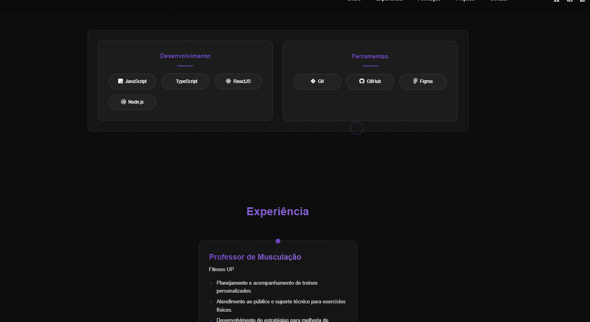

<<<<<<< HEAD
=======

>>>>>>> 4a9840241f86a39886d722d7e281abfdff192f92
# 🚀 Portfolio - David Macêdo

<p align="center">
  
</p>

## 📌 Table of Contents
- [About](#-about)
- [Technologies](#-technologies)
- [Projects](#-projects)
- [Features](#-features)
- [Layout](#-layout)
- [Getting Started](#-getting-started)
- [Contact](#-contact)

## 💡 About

Professional portfolio developed with a focus on performance, accessibility, and responsive design. It showcases my career transition journey to Front-end Development, highlighting projects, skills, and experiences.

### ✨ Highlights
- Modern and minimalist design
- Light/Dark theme
- Fully responsive
- Interactive image carousel
- Smooth animations
- Intuitive interface

## 🛠 Technologies

### Core
- 
- 
- 

### Libraries & Frameworks
- 
- 
- 

## 💼 Projects

### Gimnofange Health Club
- Modern gym website
- Light/Dark theme system
- Interactive image carousel
- Responsive design
- [Live Demo](https://trydavidqix.github.io/gimnofange/)
- [Source Code](https://github.com/trydavidqix/gimnofange)

### Elegance Jewelry
- Handcrafted jewelry e-commerce
- Elegant and sophisticated design
- Product catalog
- Custom contact system
- [Live Demo](https://trydavidqix.github.io/elegance-jewelry/)
- [Source Code](https://github.com/trydavidqix/elegance-jewelry)

### Pão com Amor (Artisanal Bakery)
- Artisanal bakery website
- Product catalog
- Image gallery
- Online ordering system
- [Live Demo](https://trydavidqix.github.io/Artisanal-Bakery/)
- [Source Code](https://github.com/trydavidqix/Artisanal-Bakery)

## 🎯 Features

### Main Sections
1. **Hero**
   - Smooth animations
   - Custom cursor
   - Gradient effects

2. **About**
   - Professional bio
   - Tech stack
   - Photo with effects

3. **Experience**
   - Interactive timeline
   - Professional history
   - Key responsibilities

4. **Education**
   - Academic background
   - Software Engineering
   - Physical Education

5. **Projects**
   - Image carousel
   - Code/Demo links
   - Detailed descriptions

6. **Contact**
   - Social media
   - Direct email
   - WhatsApp business

## 📱 Layout

### Breakpoints
- Mobile: 320px - 480px
- Tablet: 481px - 768px
- Desktop: 769px+

## 🚀 Getting Started

```bash
# Clone repository
git clone https://github.com/trydavidqix/portfolio.git

# Enter directory
cd portfolio

# Open in browser
Open index.html in your browser
```

## 📞 Contact

- LinkedIn: [David Macêdo](https://www.linkedin.com/in/trydavidqix/)
- GitHub: [trydavidqix](https://github.com/trydavidqix)
- WhatsApp: [+351 910 390 394](https://wa.me/351910390394)
- Email: davidqix@live.com

---
<p align="center">
  Developed with ❤️ by David Macêdo
<<<<<<< HEAD
</p>
=======
</p> 
=======
# david-macedo-dev
🚀 Front-end Developer Portfolio showcasing responsive web projects built with HTML, CSS, and JavaScript. Features modern UI/UX, interactive components, and dark/light theme. Live projects include: Fitness Center, E-commerce, and Business websites.

>>>>>>> 4a9840241f86a39886d722d7e281abfdff192f92
